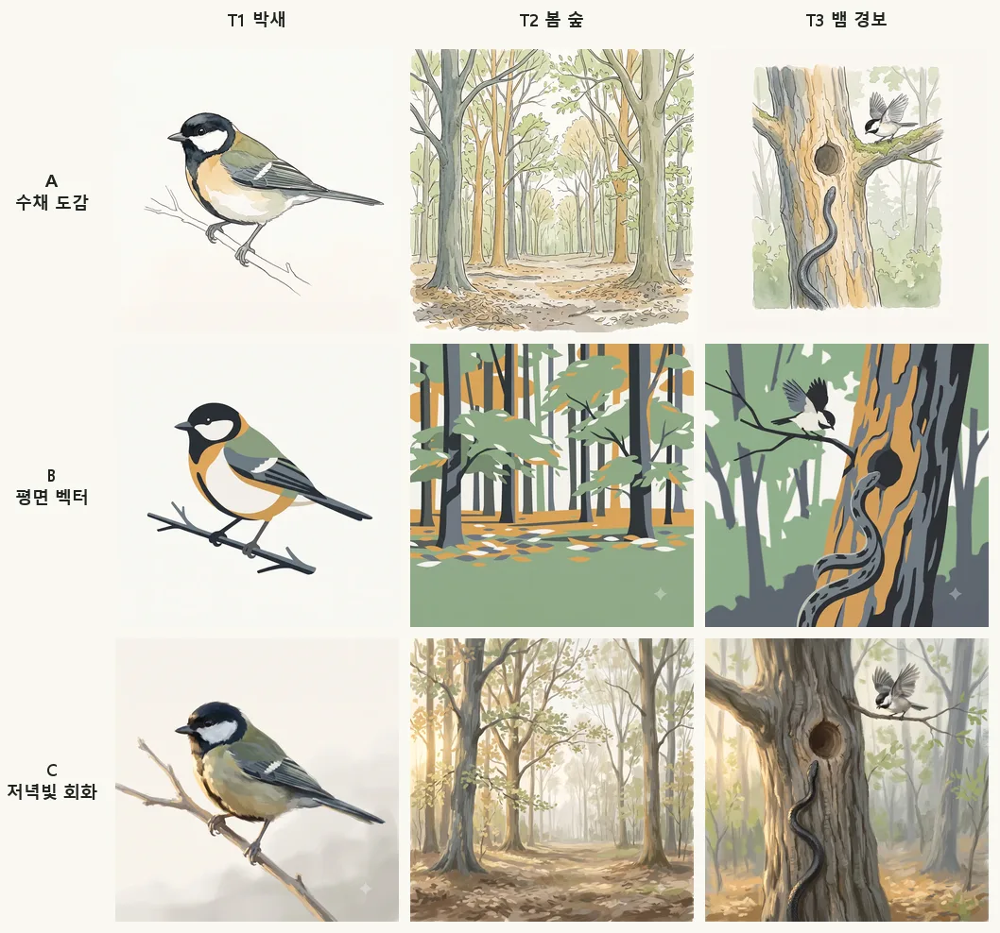
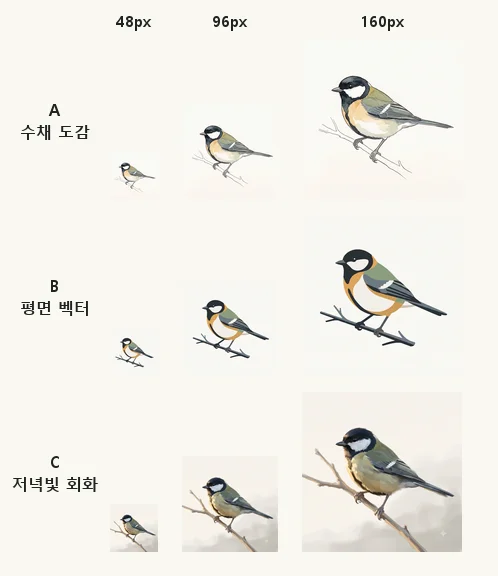
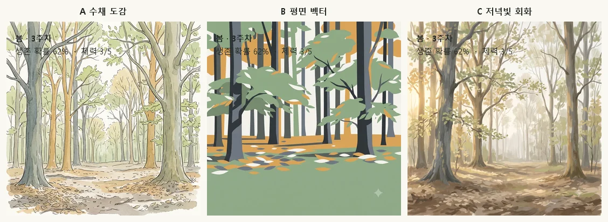

# 화풍 시안 (M0, #13)

> 소유: 아트·UX. 대표가 하나를 고르면 그 내용이 `style-guide.md` 1~3장으로 들어가고 이 문서는 기록으로 남는다.
> 결정 단계: L3(대표). 요청 이슈는 `needs:ceo`로 따로 올린다.

## 0. 무엇을 고르는 것인가

고르는 것은 **"그림"** 의 화풍이다 — 새, 배경, 포식자, 핵심 장면.
**UI(아이콘·카드·게이지·글자)는 어느 시안을 골라도 평면 벡터로 만든다.** 작은 화면에서 숫자와 확률이 또렷해야 하고(gdd 3장 원칙 5), 그림 화풍이 바뀌어도 UI를 다시 만들지 않기 위해서다. 즉 화면은 항상 **[그림 레이어] + [평면 벡터 UI 레이어]** 두 겹이다.

세 시안 모두 다음 공통 제약을 지킨다(바뀌지 않는다).

- 새는 **옆모습**, 화면을 바라보는 방향은 **왼쪽**, 캔버스 안 몸길이 비율 고정 → 종끼리 크기 비교가 되고 합성이 쉽다.
- 새·포식자는 **단색 배경**에 단독으로 그린다. 배경 그림은 **새 없이** 따로 그린다. 화면에서 합친다(art.md 7장).
- 사람·건물·도로는 그리지 않는다. 드문 인공 이벤트 전용 그림에서만(gdd 2장 7).
- 프롬프트에 실존 작가 이름을 쓰지 않는다. 사진이나 특정 그림을 따라 그리게 하지 않는다.

---

## 1. 시안 A — 담색 수채 생태도감 (watercolor field guide) **← 아트 추천**

종이 위의 맑은 수채 담채 + 식별 특징만 가는 펜선으로 잡아 주는, 조류 도감 그림의 느낌. 배경은 종이 흰빛의 단색. 배경 그림은 같은 수채로 그리되 윤곽을 흐리게 두어 새가 앞으로 떠 보이게 한다.

| | |
|---|---|
| **좋은 점** | **식별 특징이 가장 잘 남는다** — 깃 무늬·눈선·가슴 세로줄 같은 가는 특징을 펜선이 지켜 준다. 생태 검토(콘텐츠)를 통과할 확률이 가장 높다. 종이 흰빛 단색 배경이라 **배경 제거가 거의 필요 없다** — 카드 바탕을 종이색으로 두면 그대로 얹힌다. 도감·기록이라는 게임의 주제(도감, 통산 기록, 가계도)와 톤이 맞는다. 용량이 작다(평탄한 색면이 많아 WebP 압축이 잘 된다). |
| **모바일 가독** | 좋음. 흰 배경 + 어두운 윤곽선이라 작은 썸네일에서도 새의 형태가 끊기지 않는다. 다만 수채 번짐이 100px 이하에서는 뭉개져 사라지므로, **작은 자리(목록·가계도)에는 같은 그림의 실루엣 버전을 쓴다**(에셋 2종 필요). |
| **생성 AI 일관성** | 보통~좋음. "watercolor field guide plate, white background"는 모델이 잘 아는 조합이라 구도·배경은 안정적이다. 흔들리는 것은 **번짐의 세기와 펜선의 굵기** — 배치마다 조금씩 달라진다. 공통 블록에 `light flat washes, thin ink outline`을 못 박고, 어긋난 후보는 버린다. |
| **약점·대가** | 분위기가 차분해서 "자연의 험난함"(한파·장마·포식) 장면이 약해 보일 수 있다. → 극적인 장면은 배경을 어둡게 하고 UI 쪽 경고색으로 긴장을 만든다. |

**테스트 공통 블록**
```
watercolor field guide illustration, light flat washes with thin dark ink outlines, muted natural palette of sage green, warm ochre, slate grey and paper off-white, soft even daylight, no texture noise, clean composition, no text, no border, no signature
```

---

## 2. 시안 B — 평면 벡터 자연 (flat graphic, limited palette)

면으로만 칠한 단순한 그림. 색은 서식지마다 4~5색으로 제한, 명암은 한 단계만. 새는 또렷한 실루엣과 몇 개의 큰 색면으로 표현한다.

| | |
|---|---|
| **좋은 점** | **모바일 가독이 가장 좋다.** 40px 아이콘부터 전체화면까지 같은 그림이 그대로 읽힌다(시안 A처럼 실루엣 버전을 따로 만들 필요가 없다). UI 아이콘과 자연스럽게 한 덩어리로 보인다 — 통일성 품이 가장 적게 든다. 용량이 가장 작다. 후보 간 편차가 작아 **선별이 빠르다**. |
| **모바일 가독** | 가장 좋음. |
| **생성 AI 일관성** | 가장 좋음. 단순할수록 모델이 같은 결과를 재현한다. 색을 숫자로 못 박을 수 있어(팔레트 단어 고정) 배치 간 색이 안 튄다. |
| **약점·대가** | **식별 특징이 가장 위험하다.** 단순화하면서 가슴 세로줄의 굵기, 뺨의 흰 범위 같은 종 구분점이 뭉개지거나 틀리게 나온다 — 네 종 중 셋이 흰·검·회색 새라 더 위험하다(박새·꼬마물떼새·저어새·두루미). 생태 검토 반려가 가장 많을 화풍이다. 또 "실제 생태"를 내세우는 게임에서 그림이 캐주얼해 보여 **장르를 오해하게 만들 수 있다**(기존 모바일 새 게임=펫 캐주얼과 구분이 안 됨, gdd 1.4). |

**테스트 공통 블록**
```
flat vector illustration, solid color shapes with no gradients, single-step shading, limited palette of five colors — sage green, warm ochre, slate grey, charcoal, off-white, crisp clean edges, no outline, no texture, no text, no border
```

---

## 3. 시안 C — 저녁빛 자연 회화 (soft painterly, atmospheric)

붓질이 보이는 부드러운 디지털 회화. 공기 원근(멀수록 흐리고 밝아짐)과 낮은 각도의 햇빛으로 깊이를 만든다. 자연의 규모와 험난함이 가장 잘 사는 화풍.

| | |
|---|---|
| **좋은 점** | **분위기와 몰입이 가장 강하다.** "자연이 주인공"(gdd 3장 원칙 3)이 그림만으로 전달된다. 배경 그림이 특히 좋아진다 — 숲·갯벌·논의 공간감, 계절·시간 변화(M5 환경 변화 시각)를 표현할 폭이 가장 넓다. 출시급으로 보이는 첫인상. |
| **모바일 가독** | **가장 나쁨.** 배경이 복잡하고 대비가 낮아 **새가 배경에 묻힌다.** 그 위에 숫자·확률·게이지를 얹으면 글자 대비(WCAG AA)를 맞추기 위해 반투명 판을 깔아야 하고, 그러면 공들인 그림이 가려진다. |
| **생성 AI 일관성** | **가장 나쁨.** 붓질 굵기·광원 방향·채도가 배치마다 흔들린다. 같은 프롬프트로도 아침빛/저녁빛이 섞여 나오고, 새를 단색 배경에 그려도 경계가 부드러워 **배경 제거가 어렵다**(합성 품이 매 장 든다). 후보를 더 많이 받아야 하므로 **대표의 시간이 가장 많이 든다.** |
| **약점·대가** | 용량이 가장 크다(그라데이션·질감 → WebP 압축 효율 낮음). 150KB 예산에서 큰 배경은 품질을 깎아야 한다. |

**테스트 공통 블록**
```
soft painterly digital illustration, visible loose brushwork, atmospheric perspective with hazy distance, low warm sunlight from the left, muted natural palette of sage green, warm ochre, slate grey and off-white, no text, no border, no signature
```

---

## 4. 시안 비교 한눈에

| | A 수채 도감 | B 평면 벡터 | C 저녁빛 회화 |
|---|---|---|---|
| 모바일 작은 화면 가독 | 좋음(작은 자리는 실루엣 병용) | **매우 좋음** | 나쁨 |
| 생성 AI 일관성 | 보통~좋음 | **매우 좋음** | 나쁨 |
| 식별 특징 보존(생태 검토 통과) | **매우 좋음** | 나쁨 | 보통 |
| 배경 제거·합성 품 | **거의 없음** | 없음 | 큼 |
| 글자·확률 얹기(WCAG AA) | 쉬움 | **가장 쉬움** | 어려움 |
| 분위기("자연의 험난함") | 보통 | 약함 | **매우 강함** |
| 용량 예산 | 좋음 | **매우 좋음** | 나쁨 |
| 대표의 생성 시간 | 보통 | **적음** | 많음 |
| 필요 에셋 종수 | 그림 + 작은 실루엣 | 그림 하나로 | 그림 + 반투명 판 설계 |

**아트 추천: A(수채 도감).** 이 게임에서 그림의 첫 임무는 "어떤 새인지 알아보게 하는 것"이다. 생태 정확성은 확정 사항이고(gdd 2장 21: 새 그림은 생태 검토를 통과해야 쓴다), B는 바로 그 지점에서 반려를 반복할 화풍이다. C는 보기에는 가장 좋지만 모바일 세로 화면에 확률·게이지를 계속 얹어야 하는 이 게임의 UI 요구와 정면으로 충돌하고, 대표의 생성 시간도 가장 많이 든다. A는 식별·가독·일관성·용량이 모두 합격선이고, 종이색 단색 배경이라 후처리가 사실상 없다.
**C의 장점은 버리지 않는다** — A를 고르면 배경 그림만 채도를 낮추고 원경을 흐리게(공기 원근) 처리해 분위기를 보강한다.
**되돌릴 수 있는가**: M0~M2에는 자리표시와 소수의 테스트 이미지만 쓰므로 바꿀 수 있다. **M3(박새 에셋 완성)부터는 되돌리기 비용이 커진다.**

---

## 5. 테스트 대상 3장 (시안마다 같은 대상)

같은 대상을 세 화풍으로 보면 차이가 드러난다. 배치 이슈는 #32.

| 번호 | 대상 | 왜 이것인가 |
|---|---|---|
| T1 | 박새 성조 수컷 옆모습, 단색 배경 | 새 에셋의 기본형. **식별 특징이 살아남는지**를 본다 |
| T2 | 봄 낮의 숲 (새 없이) | 배경 에셋의 기본형. **그 위에 글자·게이지를 얹을 수 있는지**를 본다 |
| T3 | 뱀 경보 장면 — 나무구멍 둥지에 뱀이 접근 | 핵심 장면(gdd 8.4 고유 메카닉). **긴장을 만들 수 있는지**를 본다 |

T1의 박새 식별 특징은 아래 문장을 썼다. **잠정(#11)** — 콘텐츠의 `field-marks.md`가 오면 이 문장을 교체하고, M3 최종 에셋은 반드시 콘텐츠 검토를 받는다. 화풍 비교용 테스트 이미지는 생태 검토 없이 쓴다(최종 에셋이 아니므로).

> 박새(*Parus minor*): 검은 머리와 턱, 흰 뺨, **턱에서 배까지 이어지는 검은 세로줄**, 회색빛 등, 날개의 흰 띠, 흰빛 배. (유럽 Great tit과 달리 등이 황록색이 아니고 배가 노랗지 않다.)

---

## 6. 테스트 이미지 결과 (배치 01, #32)

생성: 대표, Gemini Pro 3.1, 2026-10-03. 원본 2048px PNG를 PM이 긴 변 1024px WebP(품질 85)로 줄여 `assets/inbox/batch-01/`에 올렸다(자르기·보정 없음, 정리됨 — 2026-10-06 #25). 아래 시트 3장은 아트가 그 9장으로 만든 것이다(`docs/art/style-test/`, Pillow).



### 6.1 대상별로 본 것

| | A 수채 도감 | B 평면 벡터 | C 저녁빛 회화 |
|---|---|---|---|
| **T1 박새** | 흰 뺨·검은 머리·날개 흰 띠가 펜선으로 또렷하다. 배경이 종이색 단색 그대로 — 배경 제거 불필요 | 형태는 가장 강하다. 그러나 검은 줄이 **배가 아니라 옆구리**에 그려졌다 — 단순화가 식별 특징을 옮겨 버린 예(예상한 위험 그대로) | 깃털 질감은 가장 사실적. 배경 아래쪽에 회색 안개가 깔려 **단색 배경이 아니다** → 합성하려면 배경 제거 필요 |
| **T2 봄 숲** | 깊이·계절감 좋음. 위쪽이 밝은 종이색이라 글자 자리가 가장 넓다. 단, 가는 선이 많아 용량이 큼 | 색 5개를 정확히 지켰다. 그러나 **아래 절반이 초록 단색 바닥**이라 "숲"보다 "포스터" | 공기 원근·역광이 가장 아름답다. 대비는 낮다 |
| **T3 뱀 경보** | 구멍·뱀·새 배치가 한눈에 읽힌다. 긴장은 약하다(예상대로) | 구도가 크고 극적. 뱀 무늬가 단순해 종 구분이 안 된다 | 긴장·분위기 가장 강함. 새가 배경에 반쯤 묻힌다 |

### 6.2 측정

**작은 크기(48·96·160px)의 박새** — 목록·가계도 자리



- 48px: 셋 다 "검은 머리의 작은 새"로는 읽힌다. B가 가장 또렷, A는 가지 선이 사라지고 새만 남아 오히려 깔끔, C는 회색 배경 판이 보인다.
- → 예상(A는 작은 자리에 실루엣 병용 필요)보다 A가 작게도 잘 읽힌다. 실루엣 병용은 **48px 이하에서만** 검토.

**숲 배경 위에 UI 글자(진한 잉크 #1F2421) 얹기** — 360px 폭, 판 없이, 위쪽 정보 줄 자리



| | A | B | C |
|---|---|---|---|
| 글자 자리 픽셀 중 AA(4.5:1) 통과 | **91%** | 68% | 84% |
| 대비 중앙값 | **10.3** | 6.1 | 8.5 |
| 최저 대비 | 1.04 | 1.06 | 2.00 |

- **어느 화풍도 판 없이는 안 된다**(셋 다 나무줄기 위에서 1~2:1로 떨어진다). `style-guide.md` 3장 규칙(그림 위 글자는 판·띠 위에)을 그대로 지킨다. 판을 가장 얇게(덜 가리게) 쓸 수 있는 것은 A.

**용량** — 1024px WebP 품질 85 기준(최종 형식은 아님: 새는 768px·알파로 줄어든다)

| | A | B | C | 예산(`style-guide.md` 4장) |
|---|---|---|---|---|
| T1 박새 | 44KB | 24KB | 31KB | `bird` 150KB |
| T2 숲 | **249KB** | 58KB | 149KB | `bg` 250KB |
| T3 장면 | 109KB | 57KB | 100KB | `scene` 200KB |

- **예상이 틀린 곳**: A의 배경은 용량이 작을 것이라 했지만, 가는 펜선·낙엽 디테일 때문에 숲이 예산 한계(249/250KB)였다. A를 고르면 배경 프롬프트에 `fewer fine details in the lower half`를 넣고 품질 80으로 저장한다(시험 필요).

### 6.3 세 시안 모두에서 나온 문제 (화풍과 무관 — 다음 배치에서 고칠 것)

1. **박새의 핵심 식별 특징이 셋 다 틀렸다.** 프롬프트에 "턱에서 배 가운데로 내려가는 검은 줄"을 적었지만 9장 중 그 줄이 맞게 나온 그림이 없고, 배는 셋 다 노르스름하거나 주황빛이다(박새 *Parus minor*의 배는 흰빛 — 5장 `잠정(#11)`). T3의 새는 셋 다 검은 턱받이만 있고 배의 세로줄이 없다(박새로 보기 어렵다 — 판정은 콘텐츠). → 이것은 화풍이 아니라 **생성 모델이 "작은 박새류"를 유럽 박새·쇠박새로 끌고 가는 문제**다. 다음 배치는 콘텐츠의 `field-marks.md`(#11)로 프롬프트를 다시 쓰고, `not yellow, not buff` 같은 부정어와 "넥타이 같은 검은 줄"을 강조한다. 모든 새 그림은 어차피 콘텐츠 검토를 거친다(gdd 2장 21).
2. **비율 지시 무시**: T2·T3를 4:5 세로로 요청했지만 9장 모두 1:1. 세로 그림이 필요하면 1:1로 받아 위·아래를 잘라 쓰는 쪽으로 구도 규칙을 바꾼다(세로 4:5 = 1:1의 가로 80%를 남기고 자르기).
3. **생성 도구 표시**: 9장 모두 오른쪽 아래(가장자리에서 약 80~120px)에 반짝이 모양 표시가 있다(A는 흐림, B·C는 또렷). 최종 에셋에서는 잘라내거나 지운다 — 새·포식자는 단색 배경이라 쉽고, 배경 그림은 오른쪽 아래 10%를 잘라 낸다.
4. 사람·건물·글자·서명은 9장 모두 없었다(금지 사항은 잘 지켜짐).

### 6.4 테스트 후 판단

**추천은 그대로 A.** 실물로 봐도 식별 특징(뺨·날개 띠)을 가장 잘 지키는 것은 A의 펜선이고, B는 예상한 대로 단순화가 특징을 옮겨 그렸다. A는 단색 배경이 그대로 나와 후처리가 거의 없고, 글자 얹기 대비도 가장 좋다. 바뀐 점은 두 가지 — A는 작은 크기에서도 생각보다 잘 읽히고(실루엣 부담 감소), 배경 용량은 생각보다 크다(프롬프트로 관리).
한계: 대상마다 1장씩이라 **"배치마다 같은 화풍이 나오는가"(일관성)는 이번 9장으로 판단할 수 없다.** 선택된 화풍으로 박새 배치(M1)를 받을 때 후보 2장씩 받아 확인한다.

---

## 7. 결정 기록

| 날짜 | 무엇 | 누가 |
|---|---|---|
| 2026-10-03 | 시안 3개 작성, 아트 추천 A. 테스트 배치 #32 발행 | 아트 |
| 2026-10-03 | 테스트 9장 비교표(6장), 추천 A 유지. 선택 요청 #71 | 아트 |
| 2026-10-04 | **대표 선택: A 수채 도감** (D-015) → `style-guide.md` v1 | 대표(L3) |
