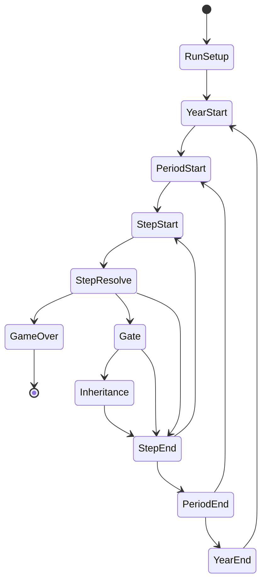
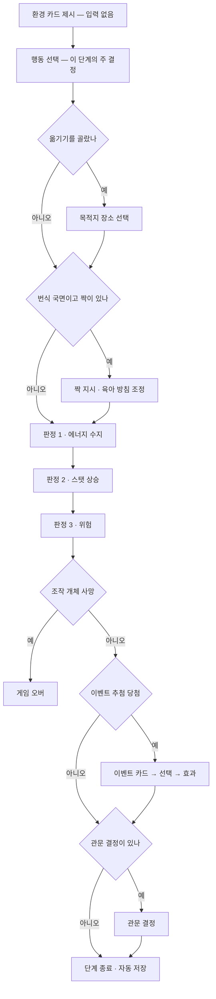

# 00 · 핵심 루프와 상태 기계

- 버전: v0 (2026-10-03, #5)
- 소유: 게임디자인 / 구현: 엔진 / 검증: QA
- 기준: 기획서 `gdd.md` 4장. 엔진 API는 `docs/studio/03-contracts.md` 3장.

## 1. 범위

런이 시작해서 게임 오버까지 **시간이 어떻게 흐르고, 플레이어가 언제 무엇을 결정하는가**를 정한다.
숫자(위험·에너지·성공률)는 `01-formulas.md`, 점수는 `02-scoring.md`, 이벤트는 `03-events.md`가 맡는다.

M0의 대상은 **박새 1종**이다. 이동(leg) 단계와 미성숙기는 M4(두루미)에서 `07-migration.md`로 추가한다. 여기서는 박새에 필요한 것만 정한다(`01-collaboration.md` 15장).

---

## 2. 상태 기계

### 2.1 전체



| 전이 | 조건 · 규칙 |
|---|---|
| `[*] → RunSetup` | `newRun(config, data)` |
| `RunSetup → YearStart` | 4종 모두 '첫 번식기를 앞둔 젊은 성조'로 시작한다(gdd 4.1). 박새는 나이 1세, `period 1`(1월 상반) |
| `YearStart → PeriodStart` | **나이 +1.** 나이 증가는 `period 1` 진입 시점에만 일어난다. 연간 기록(그해 번식 수·결정 수)을 초기화 |
| `PeriodStart → StepStart` | 이 시기의 단계 수와 국면을 `data/calendar/<종>.json`에서 읽는다(4장) |
| `StepStart → StepResolve` | 플레이어 결정 → `act()` |
| `StepResolve → GameOver` | 조작 개체 사망 |
| `StepResolve → Gate` | 이 단계에 관문 결정이 있다 |
| `Gate → Inheritance` | 새끼가 독립했다 (6장) |
| `StepEnd` | **자동 저장**(gdd 4.2). 저장 단위는 단계다 |
| `StepEnd → StepStart` | 이 시기에 단계가 남았다 |
| `StepEnd → PeriodEnd` | 시기의 마지막 단계였다 |
| `PeriodEnd → PeriodStart` | `period < 24` |
| `PeriodEnd → YearEnd` | `period == 24` |
| `GameOver → [*]` | 점수 확정, 생애 칭호, 리더보드. **미결 점수는 없다**(`02-scoring` 2장) |

### 2.2 국면(phase)

단계마다 국면이 하나 붙는다. 국면은 **가능한 행동 목록, 이벤트 풀, 관문 결정**을 가른다. 달력 데이터가 시기별로 국면을 지정한다.

M0에서 쓰는 국면 — 박새에 실제로 쓰이는 것만 둔다.

| phase | 뜻 | 박새의 시기 |
|---|---|---|
| `winter` | 겨울 혼성군, 체온·에너지 관리 | 1–4, 23–24 |
| `pairing` | 영역 노래, 짝 맺기 | 5–6 |
| `nestSite` | 나무구멍 경쟁, 둥지 짓기 | 7 |
| `laying` | 산란 (산란 시기·산란수 결정) | 8 |
| `incubation` | 포란 (박새는 암컷 단독) | 9 |
| `nestling` | 육추 (둥지 안 급이) | 10 |
| `postFledge` | 이소 후 돌봄 → 독립 | 11–12 |
| `molt` | 털갈이 | 13–18 |
| `autumnFlock` | 가을 혼성군, 분산 | 19–22 |

- 시기와 국면의 대응은 **데이터(달력)가 진실**이고 위 표는 설계 의도다. 이상 기온 해에는 산란이 늦어져 `laying`이 `period 9`로 밀릴 수 있다(박새 고유 메카닉 '애벌레 피크 맞추기').
- `migration` `wintering` 국면은 M4에서 추가한다. M0 엔진은 몰라도 된다.

---

## 3. 한 단계의 흐름



관문 결정의 종류: 짝 후보 / 둥지 자리 / 산란수 / 육아 방침 / 2차 번식 여부 / 계승 / 계절 방침.

### 3.1 판정 순서는 고정이다

**에너지 → 스탯 → 위험** 순서로만 적용한다. 바꾸면 결과가 달라진다.

- 위험 공식에 **배고픔 보정과 지방(무게) 보정**이 들어간다(gdd 6.2). 그래서 그 단계의 에너지를 먼저 갱신하고 그 결과로 위험을 굴린다. "배고파서 위험한 곳을 고를 수밖에 없다"는 설계 의도가 이 순서에서 나온다.
- 스탯 상승은 위험보다 먼저 적용한다. 같은 단계에서 올린 경계 스탯이 그 단계의 위험 판정에 반영된다(훈련의 보상을 즉시 체감).

예시 (입력 → 출력)

- 입력: `period 2`, `winter`, 에너지 48 / 지방 상한 60, 행동 `forage`, 장소 `forest-core`
- 출력: ① 에너지 `48 + 7 − 6 = 49` → ② 채식 +1 → ③ 위험 판정에 에너지 49/60(배고픔 보정 없음) 적용 → 생존 → ④ 이벤트 미당첨 → ⑤ 관문 없음 → 자동 저장

### 3.2 장소 선택은 '옮기기' 행동에 딸린다 — 잠정(#38)

기획서 4.3은 단계마다 "장소 선택 → 행동 1개"를 따로 두었다. **명세는 이것을 바꾼다.**

- 단계의 주 결정은 **행동 1개**다. 행동 목록 안에 `옮기기(move)`가 있고, 그것을 고른 뒤에만 목적지 목록이 열린다.
- 옮긴 단계에서는 다른 행동을 하지 않는다. **이동이 그 단계의 행동이다.**
- 머무르면 장소 결정이 없다.

왜 바꾸는가

1. **결정 예산.** 단계마다 장소와 행동을 따로 물으면 박새 1년이 약 99결정이 되어 목표(60~90, gdd 4.2)를 넘는다. 번식기 단계 분할(1시기 2~3단계)을 줄이지 않고 예산을 맞추는 방법이다(5장 계산).
2. **생태적으로 더 맞다.** 이동은 공짜가 아니라 에너지를 쓰는 행동이다. "머물러 먹을까, 고갈된 자리를 떠날까"가 비용을 건 트레이드오프가 된다(gdd 10장 '먹이 터 고갈').
3. **360px 화면.** 장소 카드마다 가능한 행동을 모두 펼치면 한 화면에서 비교할 것이 너무 많다. 지금 자리의 행동 목록 + "옮기기"는 들어간다.

- 단계: **L2**(화면 흐름 — 아트·클라이언트에 영향). 게임디자인이 결정하고 #38(`type:decision`)에서 아트·클라이언트·엔진의 의견을 받는다. 의견을 받기 전까지 이 안으로 잠정 진행한다. 같은 PR에서 기획서 4.3도 고친다.
- 엔진 영향: `getChoices`는 `kind: 'action'`을 먼저 주고, `move`를 고른 상태에서만 `kind: 'node'`를 준다.

### 3.3 환경 카드와 미리보기

- 환경 카드는 결정이 아니다. 계절·날씨·사건을 보여주기만 한다(gdd 4.3).
- 행동을 고르기 **전에** `preview()`로 예상 위험%와 예상 성장량을 보여준다(gdd 3장 원칙 5). `preview`는 난수를 쓰지 않는다.
- 확률 표시 방법(반올림·범위)은 `01-formulas.md`가 정한다.

---

## 4. 단계 분할 규칙

### 4.1 기본

| 구간 | 1시기당 단계 | 근거 |
|---|---|---|
| 평시(겨울·털갈이·가을 혼성군) | 1 | gdd 4.2 |
| 번식기 | 2~3 | gdd 4.2 — 산란·포란·육추를 촘촘하게 |
| 이동 구간 | leg마다 1 | gdd 4.2. M4에서 적용(박새는 해당 없음) |

- **상한은 시기당 3단계다.** 더 쪼개려면 결정 예산(5장)을 다시 계산해 이 명세를 고친다.
- 실제 값은 `data/calendar/<종>.json`이 시기별로 적는다. 엔진은 데이터를 읽고 이 규칙을 코드에 박지 않는다.

### 4.2 번식 실패 시 분할 해제

번식이 실패하고 그 해에 재번식을 하지 않기로 하면, **남은 번식기 시기의 단계 분할을 해제해 1단계/시기로 되돌린다.**

- 왜: 둥지가 없는 `incubation`·`nestling` 시기에는 할 일이 없다. 플레이어가 빈 단계를 반복 탭하게 하지 않는다.
- 되돌아가는 국면은 그 종의 평시 국면이다(박새는 `molt`).

예시 (입력 → 출력)

- 입력: `period 9` `incubation`(3단계/시기)에서 알 8개 전멸, 플레이어가 2차 번식을 포기
- 출력: `period 10`부터 국면 `molt`, 1단계/시기. `period 10~14`가 11단계 → 5단계로 줄어든다

### 4.3 박새 설계값

실제 데이터는 `data/calendar/parus-minor.json`(#8). 아래는 그 데이터가 맞춰야 할 설계 의도다.

| 구간 | 시기 | 국면 | 단계/시기 | 단계 수 |
|---|---|---|---|---|
| 겨울 혼성군 | 1–4 | `winter` | 1 | 4 |
| 영역·짝 | 5–6 | `pairing` | 2 | 4 |
| 둥지·산란 | 7–8 | `nestSite` `laying` | 3 | 6 |
| 포란·육추 | 9–10 | `incubation` `nestling` | 3 | 6 |
| 이소·돌봄 | 11–12 | `postFledge` | 2 | 4 |
| 2차 번식 또는 털갈이 | 13–14 | 번식 국면 또는 `molt` | 2 | 4 |
| 털갈이 | 15–18 | `molt` | 1 | 4 |
| 가을 혼성군 | 19–22 | `autumnFlock` | 1 | 4 |
| 초겨울 | 23–24 | `winter` | 1 | 2 |
| **합계** | | | | **38** |

2차 번식을 실제로 하면 `13–14`가 3단계/시기로 올라가 **40단계**가 된다.

---

## 5. 결정 횟수 예산

### 5.1 세는 규칙

**결정 1회 = 플레이어의 입력 1회.** 즉 `getChoices()`가 고를 수 있는 선택지를 2개 이상 돌려주어 플레이어의 입력을 기다리는 지점이다.

세지 않는 것: 환경 카드, 미리보기 열기·닫기, 결과 확인 탭, 선택지가 1개뿐인 지점(자동 진행).

### 5.2 박새 1년 (설계값)

| 종류 | 1차 성공 · 2차 포기 | 1차 · 2차 모두 성공 | 1차 실패 후 2차 성공 |
|---|---|---|---|
| 행동 (단계마다 1) | 38 | 40 | 38 |
| 옮기기 목적지 (행동의 약 25%) | 9 | 10 | 9 |
| 계절 방침 (`period` 5·11·17·23) | 4 | 4 | 4 |
| 짝 후보 선택 | 1 | 1 | 1 |
| 둥지 자리 | 1 | 2 | 2 |
| 산란수 | 1 | 2 | 2 |
| 짝 지시 | 5 | 8 | 7 |
| 육아 방침 (설정 + 조정) | 2 | 4 | 2 |
| 2차 번식 여부 | 1 | 1 | 1 |
| 계승 결정 | 1 | 2 | 1 |
| 이벤트 선택 (단계의 약 20%) | 8 | 8 | 8 |
| **합계** | **71** | **82** | **75** |

- 목표 60~90 안에 든다(gdd 4.2). 결정당 30~50초면 **36~68분** → 목표 40~60분과 맞는다.
- **번식을 완전히 포기한 해**(1차 실패 + 2차도 포기)는 약 56결정으로 하한 아래로 내려간다. 그 해는 실제로 할 일이 적은 것이 의도이며, 2차 번식 관문이 거의 항상 열리므로 드물다. 연속으로 일어나면 밸런스 문제이므로 QA 지표로 감시한다(5.3).
- 이 표는 **설계 목표값**이다. 실제 값은 QA가 봇 시뮬레이션으로 측정한다(gdd 13.3). 측정값이 60~90을 벗어나면 고치는 것은 달력 데이터(4.3)가 아니라 이 명세다.

### 5.3 QA에 요청하는 지표

- 연 결정 횟수의 평균과 분포(종별)
- 연 결정 횟수가 60 미만인 해의 비율 — **5% 이하**가 목표
- 결정 종류별 비중 — 행동 결정이 전체의 60~70%를 유지하는지(나머지가 많으면 관문이 과하다)

---

## 6. 계승 결정 시점

### 6.1 규칙

계승 결정은 **새끼가 독립하는 순간**에만 열린다(gdd 4.1). 순서는 고정이다.

```
독립 판정 — 1마리 이상 독립했나?
  아니오 → 번식 실패. 총 번식 수 변화 없음. 계승 결정 열리지 않음(잔류 확정)
  예     → 총 번식 수 +1 확정 (02-scoring)
           → 계승 화면: [이 개체로 1년 더] / [이 새끼로 계승]
```

- **점수가 먼저 확정되고 계승 화면이 뜬다.** 계승을 고르든 잔류를 고르든 그 번식의 +1은 이미 확정이다(gdd 4.1 '점수 확정 시점').
- 번식에 실패한 해에는 계승할 새끼가 없으므로 잔류만 가능하다(gdd 4.1). 선택지가 1개이므로 결정으로 세지 않고 자동 진행한다.
- 계승으로 떠난 부모는 NPC가 되고, 이후 그 개체의 번식은 점수에 넣지 않는다(gdd 4.1).

### 6.2 박새의 계승 기회

| 기회 | 시점 | 조건 |
|---|---|---|
| 계승 #1 | `postFledge` 종료 (`period 12`의 마지막 단계) | 1차 번식에서 1마리 이상 독립 |
| 계승 #2 | 2차 번식의 `postFledge` 종료 (`period 14` 부근) | 2차 번식에서 1마리 이상 독립 |

- **계승 #1에서 계승하면 그 해의 2차 번식은 없다.** 갈아탄 새끼는 그해에 번식하지 않는다(박새 첫 번식 1세). 그래서 "지금 좋은 새끼로 갈아탈까, 2차 번식으로 점수 1을 더 노릴까"가 그 해의 핵심 결단이 된다.
- 잔류를 고르면 곧바로 **2차 번식 여부**를 묻는다(같은 단계의 다음 관문).
- 2차 번식의 대가는 `data/balance/species/parus-minor.json`의 `secondBrood`(에너지 비용, 털갈이 지연)다. 털갈이 지연은 겨울 위험으로 돌아온다.

예시 (입력 → 출력)

- 입력: `period 12`의 마지막 단계, 1차 번식에서 새끼 5마리 독립, 총 번식 수 2, 조작 개체 나이 3세(노화 시작)
- 출력: ① 총 번식 수 **3** 확정 → ② 계승 화면(새끼 5장의 카드 + 현재 개체의 나이·노화 배율·짝 유대) → ③ 플레이어가 '잔류' → ④ 2차 번식 여부 관문 → ⑤ '한다' → `period 13`의 국면이 `laying`, 3단계/시기

---

## 7. 경계 사례

엔진과 QA는 이 7개를 그대로 테스트로 쓴다.

### B-1 에너지 0 — 아사

- 조건: 판정 1(에너지 수지) 직후 `energy <= 0`
- 결과: 조작 개체 **즉시 사망**, 게임 오버. `cause: "starvation"`. 그 단계의 스탯·위험·이벤트·관문은 모두 건너뛴다
- 에너지는 0 아래로 기록하지 않고 0으로 자른다. **0에서 버티는 단계를 두지 않는다** — 플레이어가 손 쓸 수 없는 상태를 플레이하게 하지 않으려고 확률 판정이 아니라 확정 사망으로 한다
- 대신 경고가 있다: 에너지가 지방 상한의 `energy.starvationWarnRatio` 아래면 화면에 경고를 띄우고, 위험 공식의 배고픔 보정이 커진다(`01-formulas` 3장)
- 예시: 에너지 5, 섭취 3, 소비 9 → `5 + 3 − 9 = −1` → 0으로 자름 → 아사 → 게임 오버. 그 시점의 총 번식 수가 최종 점수

### B-2 짝 사망

짝의 사망은 **그 자체로 게임 오버가 아니다.** 국면에 따라 다르게 처리한다.

| 국면 | 결과 |
|---|---|
| `pairing` `nestSite` | 짝 재탐색이 열린다. 후보가 남아 있으면 다시 맺을 수 있지만 산란이 늦어진다(애벌레 피크 엇갈림 위험↑) |
| `laying` `incubation` `nestling` | 단독 육아로 계속. 짝 지시가 사라지고 급이 능력이 크게 떨어져 새끼 생존율이 급락한다. 플레이어에게 **'둥지 포기'** 선택지를 준다(포기하면 번식 실패, 남은 에너지·깃털을 보존) |
| `postFledge` | 돌봄 효율↓. 독립 판정이 이미 진행 중이므로 번식 성공 여부에 미치는 영향은 작다 |

- 어느 경우든 짝 유대는 소멸하고, 다음 번식기에는 후보를 새로 뽑는다
- 박새의 성별 비대칭: 플레이어가 **암컷**이면 `incubation`에서 짝(수컷)이 죽어도 포란은 계속된다. 다만 수컷의 먹이 공급이 사라져 포란 중 에너지를 전부 자기가 부담한다. 플레이어가 **수컷**이면 `incubation`에서 짝(암컷) 사망은 **그 번식의 즉시 실패**다 — 박새는 암컷만 포란한다(gdd 12장 생태 오류 체크리스트)
- 예시: `period 9` `incubation`, 플레이어 암컷, 짝 사망 → 번식 계속 + 포란 중 에너지 소비 증가 + 둥지 포기 선택지. 플레이어가 수컷이었다면 → 번식 즉시 실패 + 4.2의 분할 해제

### B-3 번식 중 조작 개체 사망

- 조건: 번식 국면(`laying`~`postFledge`) 중 조작 개체 사망
- 결과: 게임 오버. **진행 중인 번식은 점수에 넣지 않는다** — 독립 전이므로 `02-scoring`의 "독립 순간 확정" 규칙과 일치한다
- 새끼·짝의 이후 운명은 시뮬레이션하지 않는다(점수와 무관하므로). 생애 기록에 "둥지에 새끼 N마리를 남기고"로만 적는다
- 예시: 총 번식 수 3, `nestling` 단계, 둥지의 새끼 6마리 생존 중 → 조작 개체 포식 → 최종 점수 **3** (4가 아니다)

### B-4 계승 직후 겨울

- 조건: 계승 결정에서 새끼로 갈아탄 뒤 그 해의 겨울(`period 23`~다음 해 `period 4`)을 어린 개체로 보낸다
- 새 조작 개체의 초기 상태

| 항목 | 값 |
|---|---|
| 나이 | 0세 (`period 1` 진입 때 1세가 된다) |
| 스탯 | `01-formulas` 은수저 공식의 시작 스탯 |
| 에너지 | 지방 상한 × `energy.inheritStartRatio` |
| 경험 | 0 |
| 지역 지식 | 초기화. 박새는 노래 레퍼토리만 일부 계승(gdd 5.4 문화) |
| 짝 · 짝 유대 · 영역 | 없음 / 0 / 없음 |

- **첫 겨울 위험 배율** `aging.firstWinterRiskMult`가 나이 0세인 동안의 `winter` 국면에 걸린다(어린 새의 첫 겨울 생존율이 낮다는 생태 사실)
- 계승한 해에 남은 번식 기회는 없다. 그 해의 번식 수는 더 늘지 않는다
- 예시: `period 12`에 계승 → 나이 0세 → `period 23` 겨울 진입 시 위험 배율에 `firstWinterRiskMult` 적용 → 다음 해 `period 1`에 1세가 되고 배율이 1.0으로 돌아간다 → `period 5`부터 짝 맺기 가능

### B-5 새끼 전멸

- 조건: 알 또는 새끼가 전부 사망 (포식, 한파, 급이 실패 등)
- 결과: 그 번식 **실패**. 총 번식 수 변화 없음. 계승 결정은 열리지 않는다(잔류 확정)
- 이미 지출한 번식 비용(에너지·깃털)은 돌려받지 않는다
- 재번식 분기
  - 시기가 `secondBrood.windowTo` 이전이면 **2차 번식(대체 번식)** 관문이 열린다
  - 포기하거나 시기가 지났으면 4.2의 **분할 해제**
- 예시: `period 9`에 알 8개 전멸 → 번식 실패 → 2차 번식 관문 → '한다' → `period 10`의 국면이 `laying`, 3단계/시기

### B-6 짝이 지시를 거절

- 거절은 **파국이 아니다**(gdd 7.2 [확정]). 짝은 자기가 선호하는 대안 행동을 하고, 결과는 원래 지시의 70~90% 효과이거나 다른 작은 이득이다
- 거절로 둥지 포기·이혼이 일어나지 **않는다**. 이혼 확률은 번식 실패 누적에서만 생긴다
- 결정 횟수에는 1회로 센다(플레이어가 지시를 입력했으므로)
- 수치와 대안 행동 표는 `01-formulas` 4장과 `04-breeding.md`(M1)

### B-7 계승 화면에서 새끼가 1마리뿐

- 선택지는 여전히 2개다: [이 개체로 1년 더] / [이 새끼로 계승]. 자동 진행하지 않는다
- 새끼 1마리는 고를 폭이 없다는 뜻이고, 그것이 '적게 낳기' 전략의 대가다(gdd 8.3 새끼 수의 역할)

---

## 8. 엔진에 넘기는 것

`03-contracts.md` 3장의 API와 이 명세의 대응.

| 명세 | API |
|---|---|
| 3장의 "행동 선택" | `getChoices(state, data)` → `kind: 'action'` |
| 3.2의 목적지 선택 | `move`를 고른 상태에서 `getChoices` → `kind: 'node'` |
| 3.3의 미리보기 | `preview(state, choiceId, data)` — 난수 금지 |
| 판정 1·2·3 (순서 고정) | `act(state, choiceId, data)` 안에서 이 순서로 |
| 관문 결정 | `getChoices` → `kind` = `seasonPolicy` `mateCandidate` `mateOrder` `clutchSize` `parentingPolicy` `inheritance` |
| `StepEnd` 자동 저장 | `serialize(state)` |
| 단계 수·국면 | `data/calendar/<종>.json`에서 읽는다. 코드에 박지 않는다 |

엔진이 추가로 알아야 할 것

- `RunState`는 **현재 시기 안의 단계 번호**와 **그 시기의 총 단계 수**를 모두 가진다. 4.2의 분할 해제가 진행 중에 총 단계 수를 바꾸기 때문이다.
- 번식 실패·2차 번식 결정은 달력 데이터를 덮어쓴다. **달력은 기본값이고 런 상태가 실제 값이다.**
- `LogEntry.cause`에 `starvation` `predation` `cold` `injury` `disease` `aging`을 쓴다. QA의 '이벤트별 사망 기여도' 분석이 이 값을 센다(gdd 13.3).
- `02-scoring`과 `03-events`에 2차 번식 여부 관문(`kind: 'clutchSize'`로 묶지 말고 별도 `kind`가 필요한지)은 엔진 합의 사항이다 — `type:decision` 이슈에서 다룬다.

## 9. 남은 것

| 무엇 | 어디서 | 언제 |
|---|---|---|
| 짝 지시 목록과 수락 요인 수치, 육아 방침 7항목의 효과 | `04-breeding.md` | M1 |
| 계승으로 넘어가는 것·초기화되는 것의 전체 표 | `05-inheritance.md` | M1 |
| 계승으로 떠난 부모의 기록을 남길지 (gdd 15장 미결 2) | `05-inheritance.md` | M1 |
| 첫 개체의 성별 선택 (gdd 15장 미결 4) | `05-inheritance.md` | M1 |
| 이동(leg) 단계, 미성숙기와 시간 압축 (gdd 15장 미결 3) | `07-migration.md` | M4 |
