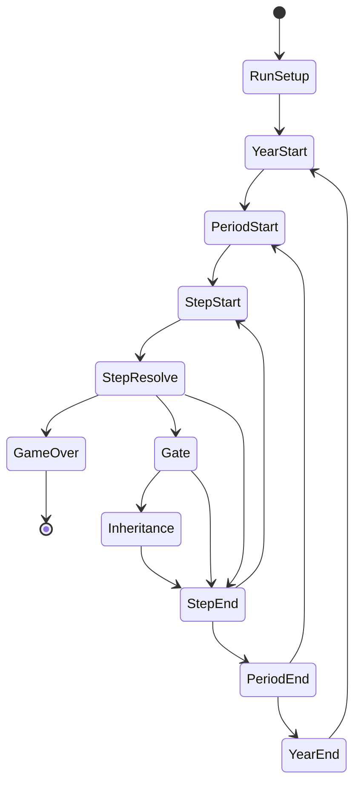
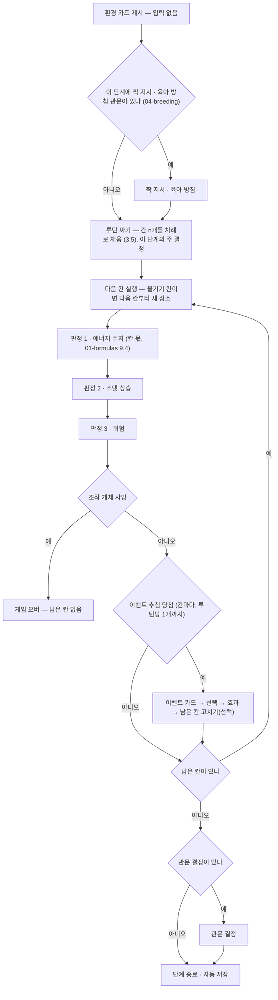

# 00 · 핵심 루프와 상태 기계

- 버전: v0.4 (2026-10-07, #5 · #38 · #8 단계표 · #73 · #22 박새 지도 · #175 행동 루틴 잠정)
- 소유: 게임디자인 / 구현: 엔진 / 검증: QA
- 기준: 기획서 `gdd.md` 4장. 엔진 API는 `docs/studio/03-contracts.md` 3장.

## 1. 범위

런이 시작해서 게임 오버까지 **시간이 어떻게 흐르고, 플레이어가 언제 무엇을 결정하는가**를 정한다.
숫자(위험·에너지·성공률)는 `01-formulas.md`, 점수는 `02-scoring.md`, 이벤트는 `03-events.md`가 맡는다.

M0의 대상은 **박새 1종**이다. 이동(leg) 단계와 미성숙기는 M4(두루미)에서 `07-migration.md`로 추가한다. 여기서는 박새에 필요한 것만 정한다(`01-collaboration.md` 15장).

---

## 2. 상태 기계

### 2.1 전체



| 전이 | 조건 · 규칙 |
|---|---|
| `[*] → RunSetup` | `newRun(config, data)` |
| `RunSetup → YearStart` | 4종 모두 '첫 번식기를 앞둔 젊은 성조'로 시작한다(gdd 4.1). 박새는 나이 1세, `period 1`(1월 상반) |
| `YearStart → PeriodStart` | **나이 +1.** 나이 증가는 `period 1` 진입 시점에만 일어난다. 연간 기록(그해 번식 수·결정 수)을 초기화 |
| `PeriodStart → StepStart` | 이 시기의 단계 수와 국면을 `data/calendar/<종>.json`에서 읽는다(4장) |
| `StepStart → StepResolve` | 플레이어 결정 → `act()` |
| `StepResolve → GameOver` | 조작 개체 사망 |
| `StepResolve → Gate` | 이 단계에 관문 결정이 있다 |
| `Gate → Inheritance` | 새끼가 독립했다 (6장) |
| `StepEnd` | **자동 저장**(gdd 4.2). 저장 단위는 단계다 |
| `StepEnd → StepStart` | 이 시기에 단계가 남았다 |
| `StepEnd → PeriodEnd` | 시기의 마지막 단계였다 |
| `PeriodEnd → PeriodStart` | `period < 24` |
| `PeriodEnd → YearEnd` | `period == 24` |
| `GameOver → [*]` | 점수 확정, 생애 칭호, 리더보드. **미결 점수는 없다**(`02-scoring` 2장) |

### 2.2 국면(phase)

단계마다 국면이 하나 붙는다. 국면은 **가능한 행동 목록, 이벤트 풀, 관문 결정**을 가른다. 달력 데이터가 시기별로 국면을 지정한다.

M0에서 쓰는 국면 — 박새에 실제로 쓰이는 것만 둔다.

| phase | 뜻 | 박새의 시기 |
|---|---|---|
| `winter` | 겨울 혼성군, 체온·에너지 관리 | 1–4, 23–24 |
| `pairing` | 영역 노래, 짝 맺기 | 5–6 |
| `nestSite` | 나무구멍 경쟁, 둥지 짓기 | 7 |
| `laying` | 산란 (산란 시기·산란수 결정) | 8 |
| `incubation` | 포란 (박새는 암컷 단독) | 9 |
| `nestling` | 육추 (둥지 안 급이) | 10 |
| `postFledge` | 이소 후 돌봄 → 독립 | 11–12 |
| `molt` | 털갈이 | 13–18 |
| `autumnFlock` | 가을 혼성군, 분산 | 19–22 |

- 시기와 국면의 대응은 **데이터(달력)가 진실**이고 위 표는 설계 의도다. 이상 기온 해에는 산란이 늦어져 `laying`이 `period 9`로 밀릴 수 있다(박새 고유 메카닉 '애벌레 피크 맞추기').
- `migration` `wintering` 국면은 M4에서 추가한다. M0 엔진은 몰라도 된다.

---

## 3. 한 단계의 흐름



관문 결정의 종류: 짝 후보 / 둥지 자리 / 산란수 / 육아 방침 / 2차 번식 여부 / 계승 / 계절 방침.

칸이 1개인 단계는 없다(평시 6칸, 번식기 2~3칸). 아래 3.1의 판정 순서는 **칸마다** 지킨다. 예시 숫자는 칸 6개를 모두 같은 행동으로 채운 단계 = 지금의 단계 1개 값이다(9.4 — 단계 값을 칸 수로 나눔).

### 3.1 판정 순서는 고정이다

**에너지 → 스탯 → 위험** 순서로만 적용한다. 바꾸면 결과가 달라진다.

- 위험 공식에 **배고픔 보정과 지방(무게) 보정**이 들어간다(gdd 6.2). 그래서 그 단계의 에너지를 먼저 갱신하고 그 결과로 위험을 굴린다. "배고파서 위험한 곳을 고를 수밖에 없다"는 설계 의도가 이 순서에서 나온다.
- 스탯 상승은 위험보다 먼저 적용한다. 같은 단계에서 올린 경계 스탯이 그 단계의 위험 판정에 반영된다(훈련의 보상을 즉시 체감).

예시 (입력 → 출력)

숫자는 `01-formulas` v0의 예시(2.3 · 2.4 · 2.5 · 2.6 · 3.1 첫 줄)에 잠 회복(9.4)을 더해 이어 붙인 것이다. 6칸 모두 `forage`인 단계 하나의 합이다 — 각 단계의 값은 그 예시로 테스트하고, 여기서는 **순서**를 본다.

- 입력: `period 2`(`winter`), 에너지 40 / 지방 상한 67, 깃털 60, 채식 70 · 경계 70, 경험 1년, 나이 1, 혼성군(무리). 장소: 먹이 `medium` · 경쟁 `low` · 위험 `medium`, 연속 체류 2. 행동 `forage`
- 출력: ① 판정 1 — 섭취 10.089, 소비 9, 잠 회복 1(`winter`, `01-formulas` 9.4) → 에너지 **42.089**(r = 0.6282), 깃털 **58.5** → ② 판정 2 — 채식만 오른다(경계는 그대로 70) → ③ 판정 3 — r 0.613은 배고픔(0.4 미만)·지방(0.8 초과) 구간이 아니고 깃털 58.5 ≥ 50이라 보정 없음 → 위험 **0.004155** → `u < 0.004155`면 사망 → ④ 이벤트 추첨 → ⑤ 관문 없음 → 자동 저장
- 순서가 결과를 바꾸는 예: 같은 입력에서 에너지가 20이었다면 ①의 결과 r = 0.3297 → 배고픔 보정 `1 + 2.5 × (0.4 − 0.3297)` = 1.176이 **같은 단계의** 위험에 곱해진다. 행동이 `explore`였다면 ②에서 오른 경계가 ③에 바로 쓰인다.

### 3.2 장소 선택은 '옮기기' 행동에 딸린다 — #38 결정 A

기획서 4.3은 단계마다 "장소 선택 → 행동 1개"를 따로 두었다. **명세는 이것을 바꾼다.**

- 단계의 주 결정은 **행동 1개**다. 행동 목록 안에 `옮기기`가 있고, 그것을 누르면 목적지 목록이 펼쳐진다.
- **"옮기기 + 목적지"는 입력 1회다.** 엔진은 행동과 목적지를 한 목록으로 주고, 목적지를 고르는 순간 `act` 1회로 이동과 단계 진행이 끝난다. 목록을 펼치고 닫는 것은 화면만의 상태다(결정이 아니고, 엔진 상태·저장 파일에 남지 않는다).
- 옮긴 단계에서는 다른 행동을 하지 않는다. **이동이 그 단계의 행동이다.**
- 머무르면 장소 결정이 없다.
- **목적지는 지금 장소와 연결된 장소만** 나온다(`data/nodes/`의 연결, `03-contracts` 4.4). 박새 지도는 **장소마다 연결 2~4개**로 설계한다 — 목적지 목록은 최대 4개. 박새 지도의 범위와 장소는 3.4.

왜 바꾸는가

1. **결정 예산.** 단계마다 장소와 행동을 따로 물으면 박새 1년이 약 99결정이 되어 목표(60~90, gdd 4.2)를 넘는다. 번식기 단계 분할(1시기 2~3단계)을 줄이지 않고 예산을 맞추는 방법이다(5장 계산).
2. **생태적으로 더 맞다.** 이동은 공짜가 아니라 에너지를 쓰는 행동이다. "머물러 먹을까, 고갈된 자리를 떠날까"가 비용을 건 트레이드오프가 된다(gdd 10장 '먹이 터 고갈').
3. **360px 화면.** 장소 카드마다 가능한 행동을 모두 펼치면 한 화면에서 비교할 것이 너무 많다. 지금 자리의 행동 목록 + "옮기기"는 들어간다.

- 결정: **L2**, #38에서 아트·클라이언트·엔진 모두 A 찬성으로 확정(2026-10-03). 입력 1회 구성은 클라이언트 제안을 엔진이 채택한 것이다.
- 엔진 영향: `getChoices`는 **평평한 목록 하나**를 준다 — 지금 자리의 행동(`kind: 'action'`, `action.<행동>`) + 연결된 목적지마다(`kind: 'node'`, `move.<장소 id>`). `옮기기` 자체는 선택지가 아니다. `preview(state, 'move.<장소 id>')`가 목적지별 예상치(이동 비용·새 자리 위험)를 준다.

### 3.3 환경 카드와 미리보기

- 환경 카드는 결정이 아니다. 계절·날씨·사건을 보여주기만 한다(gdd 4.3).
- 행동을 고르기 **전에** `preview()`로 예상 위험%와 예상 성장량을 보여준다(gdd 3장 원칙 5). `preview`는 난수를 쓰지 않는다.
- 확률 표시 방법(반올림·범위)은 `01-formulas.md`가 정한다.

### 3.4 박새 지도 — 기획서 미결 5 (#22)

콘텐츠의 생태 의견(#22 댓글, SRC-004 · SRC-024)을 그대로 받는다. **장소 5개, 모두 '숲과 그 주변' 한 권역.** 박새는 텃새라 이동 경로·월동지가 없다.

| 장소 (id는 콘텐츠가 `data/nodes/`에서 확정) | 서식지 태그(최소) | 게임에서 맡는 대비 — 콘텐츠가 계절별 등급을 쓸 때의 의도 |
|---|---|---|
| `old-broadleaf-forest` 활엽수 노숙림 | `forest` | 봄·여름 먹이가 가장 많고 **경쟁도 가장 높다**. 번식하러 오는 곳 |
| `pine-forest` 소나무숲 | `forest` | **겨울 먹이**가 가장 낫다. 봄·여름은 보통 |
| `forest-edge` 숲 가장자리·덤불 | `forest` | 모든 계절 중간. 가을·겨울 혼성군이 다니는 곳. 지도의 가운데 |
| `village-farmland` 농촌 마을 주변 | `settlement` | 먹이는 **숲보다 적고**, **위험·경쟁이 낮다**. 안전하지만 크게 얻지 못한다 |
| `urban-park` 도시 공원·정원 | `settlement` | 인공새집이 있는 사람 곁. 위험 요인이 숲과 다르다(콘텐츠가 등급으로) |

- **연결**(양방향, 장소마다 2~4개): 숲 가장자리가 나머지 넷과 이어지고(4개), 숲 둘(노숙림 ↔ 소나무숲)과 사람 곁 둘(마을 ↔ 공원)이 서로 이어진다(각 2개). 어느 장소에서든 2번 옮기면 어디든 간다.
- **런 시작 장소: `forest-edge`** — 종 밸런스의 `runStart.node`에 둔다(장소 파일은 생태만 담는다). 런은 1월(시기 1, 겨울 혼성군)에 시작하고, 가장자리에서는 첫 단계부터 목적지 넷이 모두 보여 지도를 바로 익힌다. 엔진이 첫 `data/nodes/` 스키마 PR에 `runStart.node` 키를 더하고 `data/balance/species/parus-minor.json`에 이 값을 넣는다(`review:design`).
- **서식지 태그**: 이벤트의 `habitatAny`(`03-events` 4장)가 쓰는 태그는 위 두 개 — `forest` · `settlement` — 를 최소로 둔다. 콘텐츠가 장소마다 태그를 더 붙여도 된다(예: `broadleaf`). 이벤트 컨셉(`event-concepts/parus-minor.md`)은 이 두 태그만 쓴다.
- **어느 장소도 늘 최선이 아니게**: 계절별로 1위 장소가 달라야 한다(봄·여름 노숙림, 겨울 소나무숲, 위험을 피할 때 마을). 등급 초안은 콘텐츠, 등급의 숫자는 `nodeTiers`(`01-formulas` 2.3), 조정은 QA 리포트(#26)로.
- 왜 3개가 아니라 5개인가: 3개(노숙림·가장자리·마을)는 "번식 최적 / 중간 / 안전"만 남아 **겨울 먹이 장소**(소나무숲)와 **인공새집**(공원)의 대비가 빠진다. 5개면 목적지 목록은 최대 4개로 화면(`screens.md`)에 들어간다.
- 두루미(M4)·나머지 종(M5)의 지도는 그때 정한다.

### 3.5 행동 루틴 — 한 단계를 칸 여러 개로 (#175, 잠정)

> **대표 결정(2026-10-07, #175)**: "행동이 적다. 하루이틀에 한 행동 정도는 해야 한다." 한 시기(약 14일)에 행동 5~7개로 된 **루틴**을 정해 넘기면 하나씩 순서대로 시뮬레이션한다.
> 칸 단위 수치는 `01-formulas` 9.4(#174 2단계). 엔진 구현 #203(#186). 3장 그림·5.2 표는 루틴 기준으로 바꿨다(#174).

**칸(slot)** = 행동 1개가 차지하는 약 2일. **루틴** = 한 단계의 칸들을 차례로 채운 목록.

| 항목 | 규칙 | 왜 |
|---|---|---|
| 1시기의 칸 수 | **6** (잠정 — 아래 '칸 수 스탯' 검토 뒤 확정) | 14일 ÷ 약 2.3일. 대표 범위 5~7의 가운데 |
| 한 단계의 칸 수 | `6 ÷ 그 시기의 단계 수` — 평시 1단계 = 6칸, 번식기 2단계 = 3칸씩, 3단계 = 2칸씩 | 단계표·국면·관문(4장)을 그대로 둔다. 칸 길이가 어느 시기든 같다 |
| 루틴을 짜는 때 | **단계마다 1번**, 판정 전에. 짝 지시·육아 방침 관문(4.6)은 루틴보다 먼저 받는다 | 지금의 "행동 1개"가 "칸 N개"로 바뀔 뿐 흐름은 같다 |
| 기본값 | 바로 전 단계의 루틴을 앞에서부터 채워 둔다(칸 수가 다르면 자르거나 마지막 칸을 반복). 확인만 누르면 진행 | 입력 부담. 평시에 같은 루틴을 이어 가기 쉽게 |
| 옮기기 칸 | `move.<장소>`는 칸 하나를 쓴다. **다음 칸부터** 새 장소다. 한 루틴에 옮기기 여러 번 가능 | 3.2(이동이 그 칸의 행동)를 칸 단위로 |
| 진행 | 칸마다 **판정 1~3**(에너지 → 스탯 → 위험, 3.1)을 차례로. 칸의 결과를 짧게 보여 주고 다음 칸 | 판정 순서 고정은 그대로 |
| 사망 | 칸의 판정 3에서 죽으면 그 자리에서 게임 오버. 남은 칸은 하지 않는다 | |
| 아사 | 칸의 판정 1에서 에너지 0 → B-1 | |
| 이벤트 | 추첨은 **칸마다**(칸 확률 = `1 − (1 − 단계 확률)^(1/칸 수)`, `01-formulas` 9.4). 당첨되면 루틴을 멈추고 카드 → 선택 → 효과. 그 뒤 **남은 칸을 고칠 수 있다**(고치지 않으면 그대로 진행. 고치는 것은 결정으로 세지 않는다) | 사건이 계획을 흔들 때 대응할 수 있게 |
| 한 루틴의 이벤트 상한 | **1개** — 첫 당첨 뒤 그 단계의 남은 칸은 추첨하지 않는다 | 이벤트 자리 수(4.8)와 결정 예산(5.4)을 단계 기준으로 유지 |
| 관문(그 밖) | 지금처럼 **단계 끝**, 마지막 칸 뒤 | 4.6 그대로 |
| 연속 체류 | 칸 단위로 센다(도착한 칸 0). 고갈은 `연속 체류 ÷ 칸 수`로 계산(`01-formulas` 9.4) | 고갈이 칸마다 쌓여야 "머물기 vs 옮기기"가 산다 |

엔진 영향: API 계약은 `03-contracts` 3장 '행동 루틴'(#191) — **칸 하나 = `act` 하나**, 마지막 칸을 채우는 `act`가 루틴을 실행한다. 칸 단위 수치(에너지·확률은 단계 값을 칸 수로 나눔, 잠 회복, 칸당 스탯 상승)는 `01-formulas` 9.4(#174).

**칸 수 스탯 (대표 아이디어, 검토 중)** — "한 시기의 칸 수를 스탯으로 정하면 재밌겠다."

- 생태로는 **하루의 시간 예산**(먹이 찾기에 쓰고 남는 시간)에 해당한다 — 콘텐츠 확인 필요. 시간 예산은 이미 채식 효율이 정하므로, 새 스탯보다 기존 스탯에 붙이는 쪽이 자연스럽다.
- 위험: 칸 +1 = 행동 +17%(6칸 기준)로, 다른 스탯 +10의 효과(약 5~8%, #174 표)보다 몇 배 강하다. 들이면 문턱을 높게(예: 한 스탯이 80 이상이면 +1, 최대 7) 둔다.
- 결정: #174의 스탯 효과 스케일 표를 만든 뒤 넣을지 정한다. 그때까지 **6칸 고정**. 기획서 5.1 스탯 표가 바뀌면 대표에게 알린다.

---

## 4. 단계 분할 규칙과 단계표

### 4.1 기본

| 구간 | 1시기당 단계 | 근거 |
|---|---|---|
| 평시(겨울·털갈이·가을 혼성군) | 1 | gdd 4.2 |
| 번식기 | 2~3 | gdd 4.2 — 산란·포란·육추를 촘촘하게 |
| 이동 구간 | leg마다 1 | gdd 4.2. M4에서 적용(박새는 해당 없음) |

- **상한은 시기당 3단계다.** 더 쪼개려면 결정 예산(5장)을 다시 계산해 이 명세를 고친다.
- 실제 값은 단계표 `data/calendar/<종>.json`이 적는다(4.3). 엔진은 데이터를 읽고 이 규칙을 코드에 박지 않는다.
- **단계표는 기본값이고 런 상태가 실제 값이다.** 재번식(4.4)과 분할 해제(4.5)가 그 해의 남은 시기를 덮어쓴다. 다음 해 `period 1`에 단계표로 돌아간다.

### 4.2 둥지 국면

`nestSite` `laying` `incubation` `nestling` `postFledge`를 **둥지 국면**이라 부른다. 둥지(알·새끼)가 있을 수 있는 국면이다. `pairing`은 둥지 국면이 아니다.

### 4.3 단계표 형식 — `data/calendar/<종>.json`

```json
{
  "speciesId": "parus-minor",
  "periods": [
    { "period": 1, "steps": ["winter"] },
    { "period": 7, "steps": ["nestSite", "nestSite", "nestSite"] }
  ],
  "rebrood": [
    { "steps": ["nestSite", "laying", "incubation"] },
    { "steps": ["nestling", "nestling", "postFledge"] }
  ]
}
```

| 필드 | 뜻 |
|---|---|
| `periods` | 시기 1~24가 **차례로 한 번씩**. `steps`는 그 시기의 단계마다의 국면 이름. **길이 = 그 시기의 단계 수**(1~3) |
| `rebrood` | 재번식(4.4)을 하면 **다음 시기부터** 차례로 덮어쓰는 시기들. 형식은 `periods`의 항목에서 `period`만 뺀 것 |

- 국면 이름은 2.2 표의 것만 쓴다. 이벤트의 `phaseAny`, 종 밸런스의 `predatorActivity` 키·`flockPhases`도 같은 이름이다 — 검증기가 단계표 기준으로 교차 확인한다(엔진에 요청, #8).
- **행동 목록은 단계표에 두지 않는다.** v0에서는 모든 국면에서 6개 행동(`formulas.actions`)을 모두 고를 수 있다. 국면별 제한이나 종 고유 행동이 생기면(`04-breeding`, M1) 그때 필드를 더한다.
- **관문은 단계표에 두지 않는다.** 국면이 바뀌는 때로 정해진다(4.6).

박새 기본 단계표 (`data/calendar/parus-minor.json`)

| 구간 | 시기 | 국면 | 단계/시기 | 단계 수 |
|---|---|---|---|---|
| 겨울 혼성군 | 1–4 | `winter` | 1 | 4 |
| 영역·짝 | 5–6 | `pairing` | 2 | 4 |
| 둥지 자리 | 7 | `nestSite` | 3 | 3 |
| 산란 | 8 | `laying` | 3 | 3 |
| 포란 | 9 | `incubation` | 3 | 3 |
| 육추 | 10 | `nestling` | 3 | 3 |
| 이소·돌봄 | 11–12 | `postFledge` | 2 | 4 |
| 2차 번식 자리 | 13–14 | `molt` (재번식하면 `rebrood`) | 2 | 4 |
| 털갈이 | 15–18 | `molt` | 1 | 4 |
| 가을 혼성군 | 19–22 | `autumnFlock` | 1 | 4 |
| 초겨울 | 23–24 | `winter` | 1 | 2 |
| **합계** | | | | **38** |

- 13–14는 2차 번식을 하지 않으면 털갈이 2단계/시기다. 1차 번식을 마친 직후라 행동(채식·휴식으로 깃털 회복)에 무게가 있다.

### 4.4 재번식 (2차 번식 · 대체 번식)

**2차 번식 여부** 관문(4.6)에서 '한다'를 고르면, 다음 시기부터 `rebrood`의 시기들로 그 해의 단계표를 덮어쓴다.

관문이 열리는 조건 — **모두** 참이어야 한다
1. 그 해의 둥지(번식 시도)가 2개 미만이다 — 1년 최대 2번식(`02-scoring` 3장)을 구조로 보장한다
2. 살아 있는 짝이 있다
3. 다음 시기 ≤ `species.secondBrood.layByPeriod`
4. 계승 #1에서 계승하지 않았다(6.2)

- 짝은 그대로다. 짝 맺기(`pairing`)를 다시 하지 않는다.
- 털갈이 지연은 따로 계산하지 않는다. **재번식이 `molt` 시기를 차지하는 것이 곧 지연이다** — 박새는 13–14의 털갈이 4단계가 번식으로 바뀌어 겨울 전에 깃털 회복이 덜 된다(01-formulas 2.6). 그래서 `secondBrood`에 털갈이 지연 키는 없다(#91에서 스키마에서 뺐다).

예시 (입력 → 출력)

| 입력 | 그 해의 단계 |
|---|---|
| 1차 성공(`period 12` 끝 독립) → 잔류 → 2차 '한다' | 13: `nestSite laying incubation` · 14: `nestling nestling postFledge` → 15부터 기본. 1년 **40단계** |
| 1차 성공 → 잔류 → 2차 '안 한다' | 기본 그대로. **38단계** |
| `period 9`에 알 전멸 → 대체 번식 '한다' | 9의 남은 단계는 `molt`(4.5) · 10–11: `rebrood` · 12: 분할 해제로 `molt` 1단계(4.5) · 13–14 기본 → **38단계** |
| `period 12`에 이소한 새끼가 독립 전에 전멸 → '한다' | 13–14: `rebrood` (13 ≤ `layByPeriod` 13) → **40단계** |
| 대체 번식(둥지 2개째)도 성공 → 독립 | 둥지가 2개라 2차 번식 관문이 열리지 않는다 |

### 4.5 번식이 끝나면 분할 해제

그 해의 번식이 **끝나고 더 하지 않을 때**(실패 후 재번식을 안 하거나 못 할 때, 또는 재번식까지 마쳤을 때), **그 해의 남은 시기 중 둥지 국면이 든 시기는 `molt` 1단계로 바꾼다.**

- 지금 시기의 남은 단계는 수는 그대로, 국면만 `molt`로 바꾼다.
- 왜: 둥지가 없는 `incubation`·`nestling` 단계를 반복 탭하게 하지 않는다. 국면이 `molt`가 되면 깃털이 회복되고(01-formulas 2.6) 둥지 국면 이벤트도 나오지 않는다.
- 둥지 국면이 아닌 시기(13–14의 기본 `molt` 2단계 등)는 건드리지 않는다.

예시 (입력 → 출력)

- 입력: `period 9` `incubation` 1단계째에 알 8개 전멸, 플레이어가 대체 번식을 포기
- 출력: `period 9`의 남은 2단계는 `molt` · `period 10~12`는 7단계 → `molt` 3단계. 그 해 **34단계**

### 4.6 관문이 열리는 때

관문 결정은 단계표의 필드가 아니라 **국면의 경계**로 정한다. 그래서 기본 단계표와 재번식이 같은 규칙을 쓴다. 관문은 그 단계의 흐름 마지막(3장 그림의 `관문 결정`)에 열린다. 단, **짝 지시와 육아 방침**은 그 국면의 판정에 바로 걸려야 하므로 흐름의 앞(3장 그림의 `짝 지시 · 육아 방침`, 판정 1 전)에서 받는다(`04-breeding` 1장).

| 관문 | 열리는 단계 | 조건 |
|---|---|---|
| 계절 방침 | 각 계절의 첫 시기(`species.seasons`)의 첫 단계 — 박새 `period` 5·11·17·23 | 늘 |
| 짝 후보 | `pairing`의 첫 단계 | 늘. 지난해 짝이 살아 있고 이혼하지 않았으면 그 짝이 카드 1장으로 나온다(재결합) — `04-breeding` 2장 |
| 둥지 자리 | `nestSite`의 첫 단계 | 짝이 있다 |
| 산란수 | `laying`의 첫 단계 | 둥지 자리를 골랐다 |
| 짝 지시 | 둥지 국면마다 첫 단계 | 짝이 있다. 그 국면 동안 유지 — `04-breeding` 3장 |
| 육아 방침 (설정) | `nestling`의 첫 단계 | 새끼가 있다 |
| 육아 방침 (조정) | `postFledge`의 첫 단계 | 새끼가 있다. 그 밖의 단계에서는 바꾸지 않는다 — `04-breeding` 6.2 |
| 독립 판정 → 계승 | `postFledge`의 마지막 단계 | 6장 |
| 2차 번식 여부 | 계승 화면에서 잔류를 고른 직후, 또는 번식이 실패한 단계 | 4.4의 조건 |

- 조건이 거짓이면 그 관문은 열리지 않는다. 선택지가 1개뿐이면 자동 진행하고 결정으로 세지 않는다(5.1).
- 짝이 없어 `nestSite`에 들어가면 그 해의 번식은 없다. 4.5대로 둥지 국면 시기를 `molt` 1단계로 바꾼다.

### 4.7 국면 안의 단계 위치 — `phaseLastStep`

이벤트 조건 `phaseLastStep: true`는 **지금 단계가 그 국면이 이어지는 마지막 단계**일 때 참이다(`03-events` 4장, #73). 런 상태(재번식·분할 해제가 반영된 그 해의 단계표)로 판단한다.

| 상태 | `phaseLastStep` |
|---|---|
| 기본 단계표, `period 10`의 3단계째(`nestling`) | **참** — 다음 단계는 `postFledge` |
| 기본 단계표, `period 10`의 1단계째 | 거짓 |
| 재번식, `period 14`의 2단계째(`nestling`) | **참** |
| 기본 단계표, `period 11`의 2단계째(`postFledge`) | 거짓 — 12까지 이어진다 |

### 4.8 이벤트 자리 수 (콘텐츠의 이벤트 배분 근거)

단계 이벤트는 단계마다 `events.chancePerStep`(0.2)의 확률로 나온다(`03-events` 3.1). 환경 카드는 시기마다 `events.envChancePerPeriod`(0.25). 박새 기본 1년의 기대값:

| 국면 | 단계/년 | 단계 이벤트 기대 수/년 | M1 이벤트 컨셉 배분(단계 32개 중) |
|---|---|---|---|
| `winter` | 6 | 1.2 | 5 |
| `pairing` | 4 | 0.8 | 4 |
| `nestSite` | 3 | 0.6 | 3 |
| `laying` | 3 | 0.6 | 3 |
| `incubation` | 3 | 0.6 | 3 |
| `nestling` | 3 | 0.6 | 3 |
| `postFledge` | 4 | 0.8 | 3 |
| `molt` | 8 | 1.6 | 5 |
| `autumnFlock` | 4 | 0.8 | 3 |
| **합계** | **38** | **7.6** | **32** |
| 환경 카드 (`periodStart`) | 시기 24 | 6.0 | **8** |

- 배분은 국면의 단계 수에 비례하되 **국면마다 최소 3개**(짧은 국면은 같은 이벤트만 반복되기 쉽다 — 쿨다운 `events.cooldownSteps`는 이벤트마다 따로다). 여러 국면에 걸치는 이벤트(`phaseAny`에 여럿)는 가장 주된 국면 하나로 센다.
- 이 표는 이벤트 컨셉 40개(#22)와 콘텐츠의 M1 이벤트(#23)가 따른다. 단계표가 바뀌면 다시 계산한다.

---

## 5. 결정 횟수 예산

### 5.1 세는 규칙

**결정 1회 = 플레이어의 입력 1회.** 즉 `getChoices()`가 고를 수 있는 선택지를 2개 이상 돌려주어 플레이어의 입력을 기다리는 지점이다.

세지 않는 것: 환경 카드, 미리보기 열기·닫기, 결과 확인 탭, 선택지가 1개뿐인 지점(자동 진행), **옮기기 목록 펼치기**(3.2 — 옮기기 + 목적지는 행동 결정 1회로 센다).

### 5.2 박새 1년 (설계값 — 루틴 기준, 3.5)

| 종류 | 1차 성공 · 2차 포기 | 1차 · 2차 모두 성공 | 1차 실패 후 2차 성공 |
|---|---|---|---|
| 루틴 (단계마다 1 — 칸 채우기 탭은 세지 않음, 5.4) | 38 | 40 | 38 |
| 계절 방침 (`period` 5·11·17·23) | 4 | 4 | 4 |
| 짝 후보 선택 | 1 | 1 | 1 |
| 둥지 자리 | 1 | 2 | 2 |
| 산란수 | 1 | 2 | 2 |
| 짝 지시 (둥지 국면마다 1 — `04-breeding` 3.1) | 5 | 10 | 8 |
| 육아 방침 (설정 + 조정) | 2 | 4 | 2 |
| 2차 번식 여부 | 1 | 1 | 1 |
| 계승 결정 | 1 | 2 | 1 |
| 이벤트 선택 (단계의 약 40% — 칸마다 추첨, 루틴당 1개) | 16 | 16 | 16 |
| **합계** | **70** | **82** | **75** |

- '1차 실패 후 2차 성공' 열은 1차가 `incubation`에서 실패한 경우다(짝 지시 3 + 5).
- 목표 60~90 안에 든다(gdd 4.2). 결정당 시간은 루틴이 길어 결정마다 다르다 — 플레이타임은 5.4의 표(35~49분)로 본다.
- **이벤트 줄은 목표값이다.** 지금 데이터 `events.chancePerStep`은 0.2(단계의 20% → 8)다. 40%로 올리는 것은 콘텐츠의 이벤트 +16(#200)이 들어온 뒤(#174) — 이벤트 수가 그대로인데 확률만 올리면 같은 카드가 반복된다. 그 전 측정값은 이벤트 8로 센 **62 / 74 / 67**이 기준이다.
- 루틴 전(v0)의 표는 행동 1개 = 결정 1회였다. 루틴은 결정 수를 바꾸지 않고(단계 수 그대로) 결정 하나의 무게를 바꾼다 — 1년 행동은 38 → 144(24시기 × 6칸).
- **번식을 완전히 포기한 해**(1차 실패 + 2차도 포기)는 34단계(4.5)로 약 57결정(이벤트 40% 기준, 지금 확률로는 약 50)이라 하한 아래로 내려간다. 그 해는 실제로 할 일이 적은 것이 의도이며, 2차 번식 관문이 거의 항상 열리므로 드물다. 연속으로 일어나면 밸런스 문제이므로 QA 지표로 감시한다(5.3).
- 이 표는 **설계 목표값**이다. 실제 값은 QA가 봇 시뮬레이션으로 측정한다(gdd 13.3). 결정 수는 로그의 `decision` 항목으로 센다(칸마다의 `act`가 아니다 — 엔진 #203). 측정값이 60~90을 벗어나면 고치는 것은 단계표 데이터(4.3)가 아니라 이 명세다.

### 5.3 QA에 요청하는 지표

- 연 결정 횟수의 평균과 분포(종별)
- 연 결정 횟수가 60 미만인 해의 비율 — **5% 이하**가 목표
- 결정 종류별 비중 — 루틴 결정이 전체의 **50~70%**를 유지하는지(나머지가 많으면 관문·이벤트가 과하다). 옮기기는 루틴의 칸이라 따로 세지 않는다. 설계값 38 / 70 = 54% (이벤트 확률을 올리기 전에는 38 / 62 = 61%)


### 5.4 행동 루틴을 넣으면 (#175, 잠정)

결정 1회의 뜻은 그대로(5.1)다. **루틴 하나를 짜서 넘기는 것 = 결정 1회**(칸을 채우는 탭은 세지 않는다 — 옮기기 목록 펼치기와 같은 화면 입력). 대신 결정당 시간이 칸 수만큼 길어진다.

박새, 가장 흔한 해(1차 성공 · 2차 포기, 5.2 첫 열):

| 종류 | 지금 | 루틴 | 바뀐 이유 |
|---|---|---|---|
| 행동 → 루틴 (단계마다 1) | 38 | 38 | 단계 수 그대로 |
| 관문(계절 방침 · 짝 · 둥지 · 산란수 · 짝 지시 · 육아 · 2차 · 계승) | 16 | 16 | 4.6 그대로 |
| 이벤트 선택 | 8 | 약 16 | 칸마다 추첨, 루틴당 상한 1 — 단계의 약 40%로 잡는다(#174에서 확률 확정) |
| **합계(결정)** | **62** | **약 70** | 60~90 안 |
| 1년 행동 수 | 38 | **144** (24시기 × 6칸) | 대표 요구 "하루이틀에 한 행동" ≈ 2.5일에 1 |

플레이타임(1년, [확정] 40~60분과 비교):

| 무엇 | 횟수 | 1회 시간 | 합 |
|---|---|---|---|
| 칸 채우기(기본값을 고치는 탭 포함) | 144칸 | 4~6초 | 10~14분 |
| 칸 결과 보기 — 이어서 자동 재생(칸당 약 0.6초) + 확인 1탭 (#187) | 38루틴 | 약 5초 | 3분 |
| 관문 결정 | 16 | 30~50초 | 8~13분 |
| 이벤트 카드 | 16 | 30~50초 | 8~13분 |
| 환경 카드 · 미리보기 · 계승 화면 등 | 38단계 | 약 10초 | 6분 |
| **합계** | | | **35~49분** (가운데 약 42분) |

- **판단(#175 완료 조건 2)**: 1시기 **6칸을 유지**하고, 하한은 **M1 플레이테스트에서 잰다**(QA #189 구간 측정, 봇이 아니라 사람 플레이 기록). 추정 범위 35~49분의 가운데(약 42분)가 [확정] 40~60분 안이고, 하한 35분은 "기본값을 그대로 넘기고 미리보기를 보지 않는" 가장 빠른 플레이를 모든 줄에 겹친 값이다.
- 잰 값의 중앙값이 40분 아래면 고치는 손잡이 순서:
  1. **이벤트 선택 수** — 루틴당 당첨률을 올려 16 → 약 20(+2~3분). 결정 예산 74로 60~90 안이고, 이벤트가 곧 게임의 내용이라 시간이 늘어도 반복이 아니다.
  2. **1시기 7칸** — 칸 채우기 +24칸(+2~3분)뿐인데 행동이 +17%라 에너지·스탯 수치(#174)를 모두 다시 맞춰야 한다. 마지막 손잡이.
- 칸 결과는 한 장씩 넘기지 않고 이어서 자동 재생한다(아트 #187 결정, 클라이언트 동의). 위 표가 그 기준이다.

---

## 6. 계승 결정 시점

### 6.1 규칙

계승 결정은 **새끼가 독립하는 순간**에만 열린다(gdd 4.1). 순서는 고정이다.

```
독립 판정 — 1마리 이상 독립했나?
  아니오 → 번식 실패. 총 번식 수 변화 없음. 계승 결정 열리지 않음(잔류 확정)
  예     → 총 번식 수 +1 확정 (02-scoring)
           → 계승 화면: [이 개체로 1년 더] / [이 새끼로 계승]
```

- **점수가 먼저 확정되고 계승 화면이 뜬다.** 계승을 고르든 잔류를 고르든 그 번식의 +1은 이미 확정이다(gdd 4.1 '점수 확정 시점').
- 번식에 실패한 해에는 계승할 새끼가 없으므로 잔류만 가능하다(gdd 4.1). 선택지가 1개이므로 결정으로 세지 않고 자동 진행한다.
- 계승으로 떠난 부모는 NPC가 되고, 이후 그 개체의 번식은 점수에 넣지 않는다(gdd 4.1).

### 6.2 박새의 계승 기회

| 기회 | 시점 | 조건 |
|---|---|---|
| 계승 #1 | `postFledge` 종료 (`period 12`의 마지막 단계) | 1차 번식에서 1마리 이상 독립 |
| 계승 #2 | 재번식(4.4)의 `postFledge` 마지막 단계 — 박새 2차 번식이면 `period 14`의 마지막 단계 | 2차 번식에서 1마리 이상 독립 |

- **계승 #1에서 계승하면 그 해의 2차 번식은 없다.** 갈아탄 새끼는 그해에 번식하지 않는다(박새 첫 번식 1세). 그래서 "지금 좋은 새끼로 갈아탈까, 2차 번식으로 점수 1을 더 노릴까"가 그 해의 핵심 결단이 된다.
- 잔류를 고르면 곧바로 **2차 번식 여부**를 묻는다(같은 단계의 다음 관문).
- 2차 번식의 대가는 `data/balance/species/parus-minor.json`의 `secondBrood`(에너지 비용, 털갈이 지연)다. 털갈이 지연은 겨울 위험으로 돌아온다.

예시 (입력 → 출력)

- 입력: `period 12`의 마지막 단계, 1차 번식에서 새끼 5마리 독립, 총 번식 수 2, 조작 개체 나이 3세(노화 시작)
- 출력: ① 총 번식 수 **3** 확정 → ② 계승 화면(새끼 5장의 카드 + 현재 개체의 나이·노화 배율·짝 유대) → ③ 플레이어가 '잔류' → ④ 2차 번식 여부 관문 → ⑤ '한다' → `period 13–14`가 `rebrood`로 바뀐다(13의 첫 단계 `nestSite`, 3단계/시기, 4.4)

---

## 7. 경계 사례

엔진과 QA는 이 7개를 그대로 테스트로 쓴다.

### B-1 에너지 0 — 아사

- 조건: 판정 1(에너지 수지) 직후 `energy <= 0`
- 결과: 조작 개체 **즉시 사망**, 게임 오버. `cause: "starvation"`. 그 단계의 스탯·위험·이벤트·관문은 모두 건너뛴다
- 에너지는 0 아래로 기록하지 않고 0으로 자른다. **0에서 버티는 단계를 두지 않는다** — 플레이어가 손 쓸 수 없는 상태를 플레이하게 하지 않으려고 확률 판정이 아니라 확정 사망으로 한다
- 대신 경고가 있다: 에너지가 지방 상한의 `energy.starvationWarnRatio` 아래면 화면에 경고를 띄우고, 위험 공식의 배고픔 보정이 커진다(`01-formulas` 3장)
- 예시: 에너지 5, 섭취 3, 소비 9 → `5 + 3 − 9 = −1` → 0으로 자름 → 아사 → 게임 오버. 그 시점의 총 번식 수가 최종 점수

### B-2 짝 사망

짝의 사망은 **그 자체로 게임 오버가 아니다.** 국면에 따라 다르게 처리한다.

| 국면 | 결과 |
|---|---|
| `pairing` `nestSite` | 짝 재탐색이 열린다. 후보가 남아 있으면 다시 맺을 수 있지만 산란이 늦어진다(애벌레 피크 엇갈림 위험↑) |
| `laying` `incubation` `nestling` | 단독 육아로 계속. 짝 지시가 사라지고 급이 능력이 크게 떨어져 새끼 생존율이 급락한다. 플레이어에게 **'둥지 포기'** 선택지를 준다(포기하면 번식 실패, 남은 에너지·깃털을 보존) |
| `postFledge` | 돌봄 효율↓. 독립 판정이 이미 진행 중이므로 번식 성공 여부에 미치는 영향은 작다 |

- 어느 경우든 짝 유대는 소멸하고, 다음 번식기에는 후보를 새로 뽑는다
- 박새의 성별 비대칭: 플레이어가 **암컷**이면 `incubation`에서 짝(수컷)이 죽어도 포란은 계속된다. 다만 수컷의 먹이 공급이 사라져 포란 중 에너지를 전부 자기가 부담한다. 플레이어가 **수컷**이면 `incubation`에서 짝(암컷) 사망은 **그 번식의 즉시 실패**다 — 박새는 암컷만 포란한다(gdd 12장 생태 오류 체크리스트)
- 예시: `period 9` `incubation`, 플레이어 암컷, 짝 사망 → 번식 계속 + 포란 중 에너지 소비 증가 + 둥지 포기 선택지. 플레이어가 수컷이었다면 → 번식 즉시 실패 + 4.5의 분할 해제

### B-3 번식 중 조작 개체 사망

- 조건: 번식 국면(`laying`~`postFledge`) 중 조작 개체 사망
- 결과: 게임 오버. **진행 중인 번식은 점수에 넣지 않는다** — 독립 전이므로 `02-scoring`의 "독립 순간 확정" 규칙과 일치한다
- 새끼·짝의 이후 운명은 시뮬레이션하지 않는다(점수와 무관하므로). 생애 기록에 "둥지에 새끼 N마리를 남기고"로만 적는다
- 예시: 총 번식 수 3, `nestling` 단계, 둥지의 새끼 6마리 생존 중 → 조작 개체 포식 → 최종 점수 **3** (4가 아니다)

### B-4 계승 직후 겨울

- 조건: 계승 결정에서 새끼로 갈아탄 뒤 그 해의 겨울(`period 23`~다음 해 `period 4`)을 어린 개체로 보낸다
- 새 조작 개체의 초기 상태(넘어가는 것 · 처음부터인 것의 전체 표)는 `05-inheritance` 7장. 나이 0세(`period 1` 진입 때 1세), 경험 0, 짝 없음
- **첫 겨울 위험 배율**(`01-formulas` 6.3 — `species.firstWinterRiskMult`에서 은수저만큼 덜어 낸 값)이 나이 0세인 동안의 `winter` 국면에 걸린다(어린 새의 첫 겨울 생존율이 낮다는 생태 사실)
- 계승한 해에 남은 번식 기회는 없다. 그 해의 번식 수는 더 늘지 않는다
- 예시: `period 12`에 계승 → 나이 0세 → `period 23` 겨울 진입 시 위험 배율에 `firstWinterRiskMult` 적용 → 다음 해 `period 1`에 1세가 되고 배율이 1.0으로 돌아간다 → `period 5`부터 짝 맺기 가능

### B-5 새끼 전멸

- 조건: 알 또는 새끼가 전부 사망 (포식, 한파, 급이 실패 등)
- 결과: 그 번식 **실패**. 총 번식 수 변화 없음. 계승 결정은 열리지 않는다(잔류 확정)
- 이미 지출한 번식 비용(에너지·깃털)은 돌려받지 않는다
- 재번식 분기
  - 4.4의 조건(둥지 2개 미만 · 짝 생존 · 다음 시기 ≤ `secondBrood.layByPeriod`)을 만족하면 **2차 번식(대체 번식)** 관문이 열린다
  - 포기하거나 조건이 거짓이면 4.5의 **분할 해제**
- 예시: `period 9`에 알 8개 전멸 → 번식 실패 → 2차 번식 관문 → '한다' → `period 9`의 남은 단계는 `molt`, `period 10–11`은 `rebrood`(`nestSite` → … → `postFledge`), `period 12`는 `molt` 1단계(4.4 예시)

### B-6 짝이 지시를 거절

- 거절은 **파국이 아니다**(gdd 7.2 [확정]). 짝은 자기가 선호하는 대안 행동을 하고, 결과는 원래 지시의 70~90% 효과이거나 다른 작은 이득이다
- 거절로 둥지 포기·이혼이 일어나지 **않는다**. 이혼 확률은 번식 실패 누적에서만 생긴다
- 결정 횟수에는 1회로 센다(플레이어가 지시를 입력했으므로)
- 수치와 대안 행동 표는 `01-formulas` 4장과 `04-breeding.md`(M1)

### B-7 계승 화면에서 새끼가 1마리뿐

- 선택지는 여전히 2개다: [이 개체로 1년 더] / [이 새끼로 계승]. 자동 진행하지 않는다
- 새끼 1마리는 고를 폭이 없다는 뜻이고, 그것이 '적게 낳기' 전략의 대가다(gdd 8.3 새끼 수의 역할)

---

## 8. 엔진에 넘기는 것

`03-contracts.md` 3장의 API와 이 명세의 대응.

| 명세 | API |
|---|---|
| 3장의 "행동 선택" | `getChoices(state, data)` → `kind: 'action'`(`action.<행동>`) |
| 3.2의 옮기기 | 같은 `getChoices` 목록 안의 `kind: 'node'`(`move.<장소 id>`) — 행동과 함께, `act` 1회 |
| 3.3의 미리보기 | `preview(state, choiceId, data)` — 난수 금지 |
| 판정 1·2·3 (순서 고정) | `act(state, choiceId, data)` 안에서 이 순서로 |
| 관문 결정 | `getChoices` → `kind` = `seasonPolicy` `mateCandidate` `mateOrder` `nestSite` `clutchSize` `parentingPolicy` `secondBrood` `inheritance` (`04-breeding` 1장) |
| `StepEnd` 자동 저장 | `serialize(state)` |
| 단계 수·국면 | `data/calendar/<종>.json`에서 읽는다(4.3). 코드에 박지 않는다 |
| 관문이 열리는 때 | 국면의 경계로 정한다(4.6) — 단계표에 관문 필드는 없다 |
| 이벤트 조건 `phaseLastStep` | 4.7 |

엔진이 추가로 알아야 할 것

- `RunState`는 **현재 시기 안의 단계 번호**와 **그 시기의 총 단계 수**를 모두 가진다. 재번식(4.4)과 분할 해제(4.5)가 진행 중에 남은 시기의 단계 수와 국면을 바꾸기 때문이다. 그 해의 실제 단계표를 런 상태에 둔다.
- 번식 실패·2차 번식 결정은 달력 데이터를 덮어쓴다. **달력은 기본값이고 런 상태가 실제 값이다.**
- `LogEntry.cause`(사망 원인)는 아래 고정 코드만 쓴다. QA의 '이벤트별 사망 기여도' 분석이 이 값을 센다(gdd 13.3, #35).

| 코드 | 언제 |
|---|---|
| `starvation` | 에너지 0 (B-1) |
| `predation` | 단계 위험 판정(`01-formulas` 3.1)으로 사망. 포식자를 지목한 이벤트의 사망이면 `predation:<predatorId>` (`data/predators/`의 id) |
| `cold` | 한파·폭설 등 추위를 원인으로 지정한 이벤트의 사망 |
| `accident` | 충돌·폭풍·익수 등 사고를 원인으로 지정한 이벤트의 사망 |
| `disease` | 질병·기생충을 원인으로 지정한 이벤트의 사망 |

  - 이벤트의 사망 효과는 원인 코드를 반드시 지정한다(`03-events`). 이벤트 사망의 로그에는 이벤트 id도 남긴다.
  - `aging`·`exhaustion`은 **원인 코드로 두지 않는다.** 노화는 사망 원인이 아니라 위험 배율이고(`01-formulas` 4장), 번식 후 체력 고갈은 결국 `starvation`이다. QA는 로그의 나이·시기·국면으로 잘라서 본다 — 같은 사망을 두 코드로 나누면 분석이 겹친다.
- 2차 번식 여부 관문은 별도 `kind: 'secondBrood'`다(`04-breeding` 7장).

## 9. 남은 것

| 무엇 | 어디서 | 언제 |
|---|---|---|
| ~~짝 지시 목록과 수락 요인 수치, 육아 방침 7항목의 효과~~ | `04-breeding.md` v0 | ✅ #22 |
| ~~계승으로 넘어가는 것·초기화되는 것의 전체 표~~ | `05-inheritance.md` v0 | ✅ #22 |
| ~~계승으로 떠난 부모의 기록을 남길지 (gdd 15장 미결 2)~~ — 남기지 않는다 | `05-inheritance.md` 9장 | ✅ #22 |
| ~~첫 개체의 성별 선택 (gdd 15장 미결 4)~~ — 플레이어가 고른다 | `05-inheritance.md` 2장 | ✅ #22 |
| 이동(leg) 단계, 미성숙기와 시간 압축 (gdd 15장 미결 3) | `07-migration.md` | M4 |
